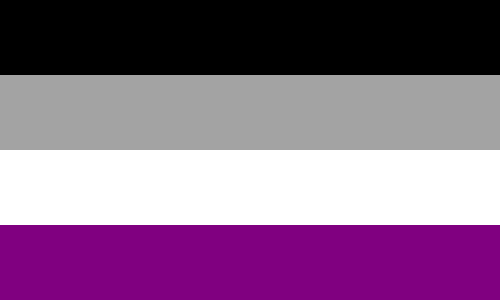
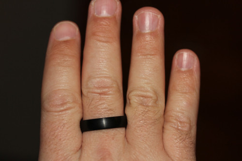
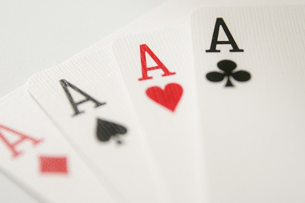

##Kurz erklärt: asexuell - Was bedeutet das?

Asexualität ist die Bezeichnung für eine sexuelle Orientierung.  
Asexuelle Menschen empfinden keine sexuelle Anziehung zu anderen Menschen, egal welchen Geschlechts.  

Andere Arten von Anziehung (z.B.romantische, sinnliche oder ästhetische Anziehung) sind davon unabhängig. Viele Asexuelle benennen zusätzlich zur sexuellen Orientierung auch ihre romantische Orientierung, z.B. als Aromantisch, Homo-, Hetero- oder Biromantisch.  

Einige Menschen empfinden zwar sexuelle Anziehung zu anderen Menschen, aber z.B. nur sehr schwach, oder sehr selten, oder nur, wenn sie schon eine lange emotionale Beziehung zu dieser Person haben. Dafür gibt es die Begriffe Gray-Asexualität (Gray-Ace) bzw. Demisexualität - um auch diese Menschen mit einzubeziehen, sprechen wir von einem asexuellen Spektrum.  

Asexualität ist in unserer Kultur oft unsichtbar, und viele Asexuelle denken, sie seien die Einzigen, denen es so geht, und fürchten, dass etwas mit ihnen nicht in Ordnung sei. Erfahrungsaustausch mit anderen Asexuellen ist hilfreich, um zu erkennen, dass Asexualität häufiger ist als vermutet und genauso in Ordnung ist wie alle anderen sexuellen Orientierungen auch.  

Deshalb wollen wir einen Raum schaffen, in dem wir uns mit anderen Menschen des asexuellen Spektrums austauschen können.  

Wenn ihr noch Fragen dazu habt: lest gerne den folgenden Text, und/oder [kontaktiert uns](/kontakt/), um Fragen zu stellen.

##Ausführlich erklärt: Inhalt

1. [Sexuelle Orientierung](#orientierung)
2. [Verschiedene Arten von Anziehung](#anziehung)
3. [Das asexuelle Spektrum](#spektrum)
4. [Was Asexualität NICHT ist](#abgrenzung)
5. [Coming Out & Unsichtbarkeit](#unsichtbarkeit)
6. [Die Ace-Community](#community)
7. [Symbole](#symbole)

##Sexuelle Orientierung

Dass Menschen sich sexuell zum gleichen Geschlecht hingezogen fühlen können (homosexuell), oder zu einem anderen Geschlecht (heterosexuell), oder auch zu Menschen verschiedener Geschlechter (bi-/pansexuell), ist den meisten Menschen bekannt.

Wo es also *"nur das eine"*, *"nur das andere"*, und *"sowohl als auch"* gibt - da ist es nur logisch, dass auch die Kategorie *"weder noch"* nicht unbedingt leer bleibt.

Asexualität ist dann die vierte Kategorie in dieser Betrachtung von sexueller Orientierung - wir fühlen uns eben weder vom eigenen noch von anderen Geschlechtern sexuell angezogen.

##Verschiedene Arten von Anziehung

Wer aber etwas genauer hinguckt, stellt fest, dass Anziehung (und damit auch Orientierung z.B. zu einem Geschlecht) nicht nur sexuell sein kann. Bei vielen Menschen treten die verschiedenen Ebenen der Anziehung meistens gemeinsam auf, deswegen ist die Unterscheidung davon noch nicht sehr weit bekannt.

Das Modell der geteilten Anziehung (englisch: *split attraction model*) beschreibt, dass es viele verschiedene Ebenen gibt, auf denen man Menschen attraktiv/anziehend finden kann. Diese Anziehungen können alle gemeinsam auftreten, aber auch einzeln oder nur Teile davon. So kann es z.B. sein, dass man einen Menschen sinnlich und romantisch, aber nicht sexuell anziehend findet, oder umgekehrt.  
Letztendlich lassen sich beliebig viele unterschiedliche Ebenen finden - für den alltäglichen Sprachgebrauch werden sie aber oft in folgenden Begriffen zusammengefasst:

**Sexuelle Anziehung:** bewirkt den Wunsch, mit derjenigen Person sexuellen Kontakt zu haben.

**Sinnliche Anziehung:** der Begriff *sinnlich* wird meistens auf den Tastsinn bezogen - sinnliche Anziehung bewirkt also den Wunsch, mit derjenigen Person körperlichen Kontakt zu haben (z.B. Kuscheln, Küssen, Hände halten). 
Genau genommen können auch andere Sinneswahrnehmungen damit gemeint sein, z.B. jemanden buchstäblich *gut riechen können* (Geruchssinn) oder die Stimme eines Menschen schön finden (Gehörsinn).

**Ästhetische Anziehung:** eine Person schön finden und sie gerne anschauen mögen. Genau genommen ist das ebenfalls eine Art von sinnlicher Anziehung (Sehsinn). 

**Romantische Anziehung:** sich emotional zu einer Person hingezogen fühlen und sich eine romantische Beziehung mit diesem Menschen wünschen. Wird auch manchmal als *Verliebtheit* oder *crush* bezeichnet.

**Platonische Anziehung:** eine andere Art von emotionaler Anziehung, die den Wunsch nach einer engen freundschaftlichen Beziehung bewirkt. Für so eine starke "freundschaftliche Verliebtheit" wurde auch der englische Begriff *squish* erfunden, sozusagen die aromantische Variante von *crush*.

Asexuelle Menschen benennen oft auch zusätzlich ihre romantische Orientierung, z.B. aromantisch, hetero-romantisch, homoromantisch oder bi-/panromantisch.  
Für alle weiteren Ebenen der Anziehung geht das theoretisch genauso, wird aber eher selten verwendet.

##Das asexuelle Spektrum

Wie immer lässt sich die Realität nicht so genau in zwei gegenteilige Schubladen einsortieren - zwischen **asexuell** (d.h. gar keine sexuelle Anziehung) und **allosexuell** (d.h. *"normal"*/üblich viel sexuelle Anziehung) gibt es auch noch einen mittleren Bereich, eine Grauzone dazwischen. Daher spricht man auch vom **asexuellen Spektrum**. 

Unter dem Überbegriff des asexuellen Spektrums gibt es sehr viele verschiedene Begriffe, mit denen Menschen ihr Empfinden genauer benennen können. Einige besonders häufig verwendete Begriffe sind:

**grau-asexuell (gray-ace):** Menschen, die nur sehr selten/wenig/schwache sexuelle Anziehung empfinden, und sich daher mit den Erfahrungen von asexuellen Menschen eher identifizieren können als mit allosexuellen Menschen. Dies ist ebenfalls ein Überbegriff für viele verschiedene Ausprägungen in einem Spektrum.

**demisexuell:** demisexuelle Menschen empfinden normalerweise keine sexuelle Anziehung - Ausnahmen davon können sich nur ergeben, wenn sie zu derjenigen Person schon eine längere, enge Bindung auf einer anderen Ebene haben (z.B. emotional oder intellektuell). Diese Art von sexueller Anziehung wird auch manchmal als *sekundäre sexuelle Anziehung* bezeichnet, im Gegensatz zu der *primären sexuellen Anziehung*, die allosexuelle Menschen auch zu fast fremden Menschen empfinden können.

**fraysexuell:** ungefähr das Gegenteil von demisexuell - die sexuelle Anziehung zu einem kaum bekannten Menschen verschwindet immer, sobald man ihn näher kennengelernt hat.

Außerdem gibt es auch ein Spektrum davon, welches Verhältnis asexuelle Menschen zu der Vorstellung haben, selbst an sexuellen Handlungen beteiligt zu sein oder z.B. von anderen Menschen sexuell attraktiv gefunden zu werden. Hier haben sich drei englische Begriffe verbreitet:

**sex-repulsed:** Sich von sexuellen Handlungen abgestoßen fühlen und nichts damit zu tun haben wollen.

**sex-indifferent:** Gleichgültiges Empfinden gegenüber sexuellen Handlungen - kein aktives Interesse, aber auch keine Abscheu davor.

**sex-favorable:** Sexuelle Handlungen gerne mögen und genießen können.

##Was Asexualität NICHT ist

Sexuelle Orientierung ist **kein körperlicher Trieb**: manche asexuellen Menschen haben eine Libido (d.h. körperlicher Drang nach sexueller Befriedigung), die aber nicht auf bestimmte Personen gerichtet ist. Sie können dann z.B. sich selbst befriedigen oder Sex mit einer anderen Person haben, ohne diese sexuell attraktiv zu finden.

Sexuelle Orientierung ist **keine Entscheidung**: Asexualität ist etwas anderes als Enthaltsamkeit oder Zölibat. Während sich manche Leute aus verschiedenen Gründen entscheiden, ihrer sexuellen Anziehung nicht nachzugeben, empfinden asexuelle Menschen diese Anziehung erst gar nicht.

Sexuelle Orientierung ist **keine Handlung**: manche asexuellen Menschen haben Sex, z.B. aus Neugierde, oder einer\*m allosexuellen Partner\*in zuliebe, oder um Kinder zu bekommen. Andere haben keinen Sex. So oder so ändert das nichts an ihrer Orientierung.

Sexuelle Orientierung ist **keine Meinung**: der Begriff *sex-positiv* bedeutet, dass man es grundsätzlich gut findet, wenn alle Menschen jeweils so viel Sex haben wie sie mögen (das kann auch *gar keinen* heißen), ohne dafür z.B. als "Schlampe" beschimpft zu werden. Auch asexuelle Menschen können sex-positiv eingestellt sein, da das eine allgemeine Meinung zu einem gesellschaftlichen Thema bezeichnet und nichts mit ihrer persönlichen Orientierung zu tun hat.

Sexuelle Orientierung ist **keine Krankheit**: viele asexuelle Menschen befüchten, dass sie krank oder gestört seien, weil sie nicht der allosexuellen Norm ensprechen. Das ist aber nur ein Anzeichen davon, dass das Wissen über Asexualität noch nicht genug verbreitet ist. Wer nicht (oder nur wegen der abwertenden Reaktionen anderer Menschen) unter der *"mangelnden"* sexuellen Anziehung leidet, ist deswegen auch nicht krank.

##Coming Out & Unsichtbarkeit

Leider wissen viele Menschen nichts über das asexuelle Spektrum und das *split attraction model* - auch viele asexuelle Menschen nicht. Sie fürchten dann, irgendwie *kaputt* zu sein, weil sie z.B. nicht verstehen, warum sie Menschen zwar attraktiv finden (z.B. romantische Anziehung) aber dann doch kein Interesse daran haben, mit ihnen sexuell intim zu sein. Durch bessere Information über Asexualität und die damit zusammenhängenden Konzepte können mehr Menschen sich selbst als asexuell begreifen, anstatt daran zu verzweifeln.

Und auch wenn man selbst die nötigen Informationen und Begriffe kennt und sich selbst im asexuellen Spektrum wiedergefunden hat: Ein Coming-out als asexuell wird oft von anderen Menschen nicht ernst genommen oder mit unsinnigen Vorurteilen missverstanden. Auch das ist eine Folge davon, dass Asexualität in unserer Kultur weitgehend unsichtbar ist.

Diese Unsichtbarkeit ergibt sich aus mehreren Aspekten:

Einerseits kann man einem Menschen eben nicht ansehen, dass er asexuell ist. Grundsätzlich kann man natürlich auch andere sexuelle Orientierungen nicht am Aussehen eines Menschen erkennen - da kommt allerdings die **Hetero- und Mononormativität** unserer Kultur ins Spiel: wer in einer romantischen Beziehung mit einem Menschen eines anderen Geschlechts ist, wird erstmal als heterosexuell angenommen. Wer sich entsprechend mit einem Menschen des gleichen Geschlechts als Partner präsentiert, wird als homosexuell angenommen, bis man explizit etwas anderes sagt. Bisexuelle Menschen haben daher ein ähnliches Problem mit der Unsichtbarkeit: anhand einer (einzelnen) Partnerschaft kann man ihre sexuelle Orientierung ebenfalls nicht einfach so erkennen.

Außerdem ist Asexualität auch noch durch **Allonormativität** unsichtbar: so lange man nicht explizit etwas anderes sagt, wird in unserer Kultur fast überall davon ausgegangen, dass man sexuelle Anziehung empfindet. Oft wird sogar völlig vergessen, dass das nicht bei *allen* Menschen so ist. Diese Annahme findet sich in den allermeisten Medien, in der Werbung (*"sex sells")*, und in den Aussagen, die wir schon als Kinder wie selbstverständlich zu hören bekommen: *"wenn du alt genug bist, dann wirst du sexuelles Interesse an anderen haben"* und so weiter...

Die asexuelle Community bemüht sich deshalb vor allem darum, mehr Sichtbarkeit zu bewirken und Aufklärung über das asexuelle Spektrum zu verbreiten.

##Die Ace-Community

Im Laufe der letzten Jahre hat sich eine große Community rund um das asexuelle Spektrum (im englischen auch oft mit der Kurzform *"ace"* bezeichnet) gebildet. 

Viel von dieser Vernetzung funktioniert über das Internet, z.B. über diverse Blogs, Gruppen auf sozialen Netzwerken, und über das Forum des [Asexual Visibility and Education Network](https://asexuality.org/) (AVEN), der größten internationalen Organisation, die sich für asexuelle Belange einsetzt.  
Mittlerweile gibt es in vielen Ländern auch weitere asexuelle Organisationen, die Informationen in der jeweiligen Sprache verbreiten und lokale Treffen organisieren. In Deutschland gibt es z.B. [AktivistA](https://aktivista.net/) und einige lokale Ace-Stammtische in queeren Zentren oder anderswo - wie wir **Amazing Aces** in Braunschweig.

##Symbole

Um Stolz über unsere Orientierung zu zeigen und um andere asexuelle Menschen, Veranstaltungen und Communities erkennen zu können, haben sich einige Symbole entwickelt.

Das bekannteste Symbol ist wohl die **asexuelle Flagge** und ihre Farben: Die schwarzen, grauen und weißen Balken symbolisieren das Spektrum von Asexualität über gray-ace bis hin zu allosexuellen Partner\*innen und Verbündeten. Der lilafarbene Balken symbolisiert die Gemeinschaft, die wir in der asexuellen Community finden.

Ein weiteres, eher unauffälliges Symbol ist ein **schwarzer Ring am rechten Mittelfinger**. Her ist aber Vorsicht angesagt, denn es gibt eine Verwechslungsgefahr - auch die Swinger-Szene verwendet manchmal schwarze Fingerringe als Symbol, wenn auch meistens an anderen Fingern.

Als Anspielung auf die englische Abkürzung *ace* (von *asexual*), was auch gleichzeitig das englische Wort für die Spielkarte *As* ist, sind **Spielkartensymbole** ebenfalls sehr beliebt in der Ace-Community. So kommt zum Beispiel auch unser *Amazing Aces*-Logo zustande.

Eher ein Insider-Meme ist der **Kuchen** als Symbol. Der Ursprung dieses Symbols ist angeblich das Forum von AVEN, in dem neue Mitglieder schon seit langem traditionell mit einem Kuchen-Emoji begrüßt wurden. Außerdem verwenden manche asexuellen Menschen gerne den (halb-)scherzhaften Spruch "ich mag lieber Kuchen anstatt Sex", und so hat sich dieses Symbol mit der Zeit immer wieder verbreitet.

Natürlich gibt es noch einige weitere Symbole, diese Aufzählung erhebt keinen Anspruch auf Vollständigkeit.

##Noch Fragen?

Wenn du etwas auf dieser Seite nicht verstehst oder noch mehr über das asexuelle Spektrum wissen möchtest, kannst du uns gerne deine Fragen [schicken](/kontakt/) oder zu unseren [Veranstaltungen](/termine/) kommen.

